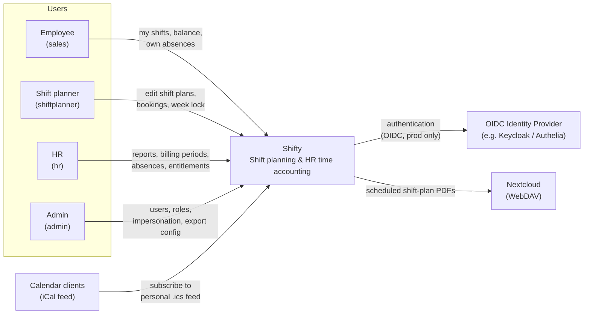
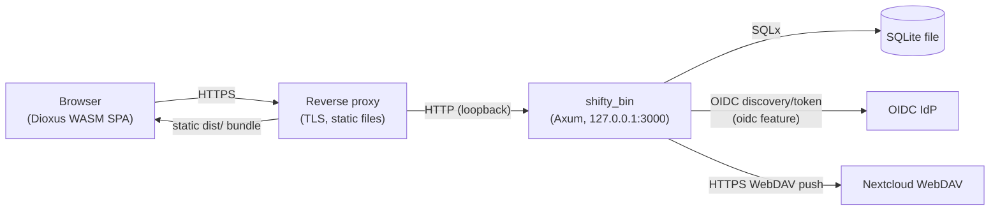

# 3. Context and Scope

## 3.1 Business Context

| Communication partner | Input to Shifty | Output from Shifty |
| --- | --- | --- |
| Employee | Own absences, availability | Own shift plan, balance report, vacation balance, iCal link |
| Shift planner | Bookings, slot changes, week status | Conflict warnings, booking log, weekly summaries |
| HR | Billing periods, extra hours, entitlements, absences for anyone | Employee reports, frozen snapshots, block reports |
| Admin | Users, roles, privileges, PDF-export config, impersonation | Audit trails, system settings |
| OIDC IdP | Identity tokens (login flow) | Redirects, token validation requests |
| Nextcloud | — | Weekly shift-plan PDFs via WebDAV (cron-scheduled) |
| Calendar clients | — | Personal `.ics` calendar feed (auth-exempt endpoint) |

Note: Shifty does **not** send email. "Email" templates only render text; delivery
is manual/external. User invitations produce a link (`APP_URL/auth/invitation/{token}`)
that must be handed to the invitee out-of-band.

## 3.2 Technical Context

| Interface | Technology | Description |
| --- | --- | --- |
| REST API | HTTP/JSON, Axum, no version prefix | All functionality; DTOs from `rest-types`; conventions in [`docs/api/conventions.md`](../api/conventions.md) |
| OpenAPI / Swagger UI | utoipa, compile-time generated | Authoritative API reference at `/swagger-ui` ([`docs/api/openapi.md`](../api/openapi.md)) |
| Session | `app_session` cookie (httpOnly, Secure, SameSite=Strict), server-side `session` table | Set after OIDC login (prod) or auto-created dev session (`mock_auth`) |
| OIDC | `axum-oidc` 0.6; env `ISSUER`, `CLIENT_ID`, `CLIENT_SECRET`, `APP_URL` | Compile-time feature `oidc`; dev builds use `mock_auth` instead |
| iCal | `GET`-able `.ics` feed, exempt from auth middleware | Personal shift calendar for calendar apps |
| WebDAV | `reqwest_dav` (rustls) | Scheduled PDF push to Nextcloud; config stored in `pdf_export_config` |

## 3.3 Scope Delimitation

**In scope:** shift planning, time accounting, absence and vacation management,
billing snapshots, exports (PDF, iCal), RBAC user management.

**Out of scope:** payroll itself (Shifty feeds it, doesn't compute salaries),
email delivery, clock-in/clock-out terminals, TLS termination and static file
serving (reverse proxy / `shifty-nix`), identity management (external IdP).
