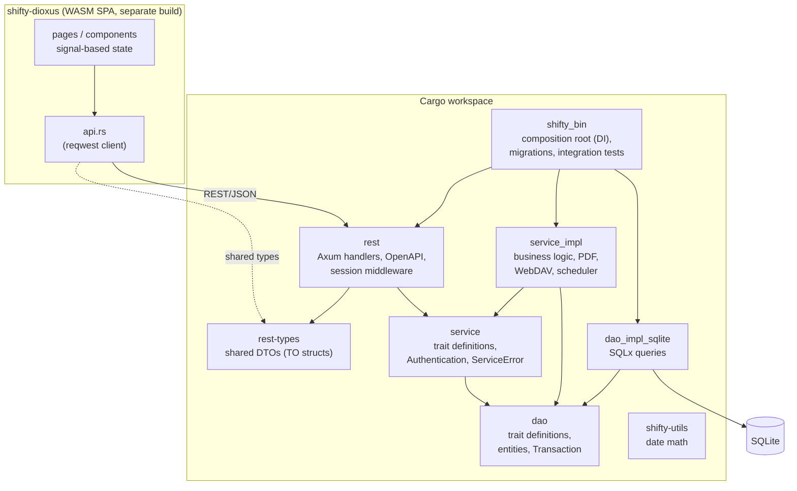
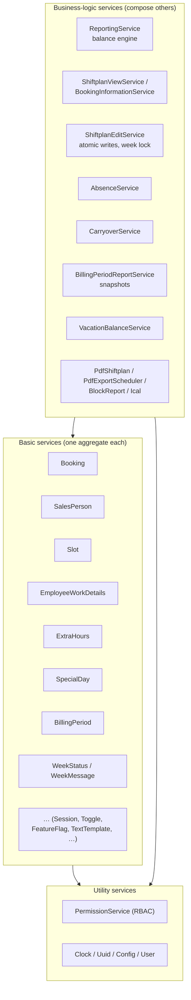

# 5. Building Block View

## 5.1 Level 1 — Whitebox: Overall System

Contained building blocks (all backend crates share version and release cycle):

| Building block | Responsibility |
| --- | --- |
| `rest` | HTTP handlers grouped per domain, routing, OpenAPI aggregation (`ApiDoc`, Swagger UI), session/auth middleware (`context_extractor`, `forbid_unauthenticated`), central `error_handler` mapping `ServiceError` → HTTP status. Knows nothing about the database. |
| `rest-types` | Transport objects (`*TO`) with serde + utoipa schemas. Single source of truth shared with the frontend; feature `service-impl` adds conversions to service types. |
| `service` | Business interface: one trait per service, domain types, `ServiceError`, `Authentication<Context>`, RBAC types (`Privilege`, `Role`, `User`). `#[automock]` on every trait. |
| `service_impl` | All business logic (one `*ServiceImpl` per trait), DI glue via `gen_service_impl!`, PDF rendering (printpdf), template engines (Tera/MiniJinja), WebDAV client, cron schedulers, unit tests. |
| `dao` | Data-access traits, entities, `DaoError`, the `TransactionDao`/`Transaction` abstraction. Knows no business rules. |
| `dao_impl_sqlite` | SQLx implementations, compile-time-checked queries, `.sqlx/` offline cache. |
| `shifty-utils` | Leaf utility crate (date math), no domain dependencies. |
| `shifty_bin` | The only executable: wires every concrete DAO and service in `main.rs` (`RestStateImpl`), runs migrations at startup, creates dev users under `mock_auth`, hosts the integration tests. No crate depends on it. |
| `shifty-dioxus` | Frontend SPA: Dioxus 0.6 → WASM, Tailwind, Dioxus Router, custom i18n (En/De/Cs), signal-based state, REST client resolving the backend URL from `/assets/config.json`. No domain logic ([06-frontend](../architecture/06-frontend.md)). |

**Dependency rule:** implementations are invisible — no crate depends on
`service_impl` or `dao_impl_sqlite` except `shifty_bin`. Layer details:
[01-layered](../architecture/01-layered.md).

## 5.2 Level 2 — Whitebox: Service Layer

The ~45 services split into two tiers plus utilities
([02-service-tiers](../architecture/02-service-tiers.md)):

Tier rules: a **basic service** manages exactly one aggregate and may consume
only DAOs, `PermissionService`, `TransactionDao`, and Clock/Uuid. A
**business-logic service** may consume basic services and other business-logic
services (acyclic). If two services need each other, one stays basic and the
shared operation moves to a third, higher service. Construction order in
`main.rs` follows the tiers, so no forward declarations are needed.

The full service list with one-liners lives in the feature docs
([F01–F14](../features/README.md)); the actual DI wiring is visualized in
[`diagrams/service-graph-runtime.mmd`](../architecture/diagrams/service-graph-runtime.mmd).

## 5.3 Level 2 — Whitebox: Data Model

The persistent model (≈30 tables) groups into aggregates; the physical ER
diagram is maintained at
[`diagrams/db-schema-er.mmd`](../architecture/diagrams/db-schema-er.mmd) and
prose documentation at [03-data-model](../architecture/03-data-model.md).

| Aggregate | Tables (main) |
| --- | --- |
| RBAC & sessions | `user`, `role`, `privilege`, `user_role`, `role_privilege`, `session`, `user_invitation` |
| Employee | `sales_person`, `sales_person_user`, `employee_work_details`, `sales_person_unavailable`, `vacation_entitlement_offset` |
| Shift plan | `shiftplan`, `slot`, `sales_person_shiftplan`, `booking` (+ `bookings_view`) |
| Time recording | `extra_hours` (legacy), `custom_extra_hours` (+ junction), `absence_period` (+ migration source), `rebooking_batch` (+ entries) |
| Accounting | `employee_yearly_carryover`, `billing_period`, `billing_period_sales_person` |
| Week metadata | `special_day`, `week_status`, `week_message` |
| Platform | `toggle` (+ groups), `feature_flag`, `text_template`, `pdf_export_config` |

Shared column conventions (soft-delete, `update_version`, audit columns) are
cross-cutting concepts → [chapter 8](08-crosscutting-concepts.md).
