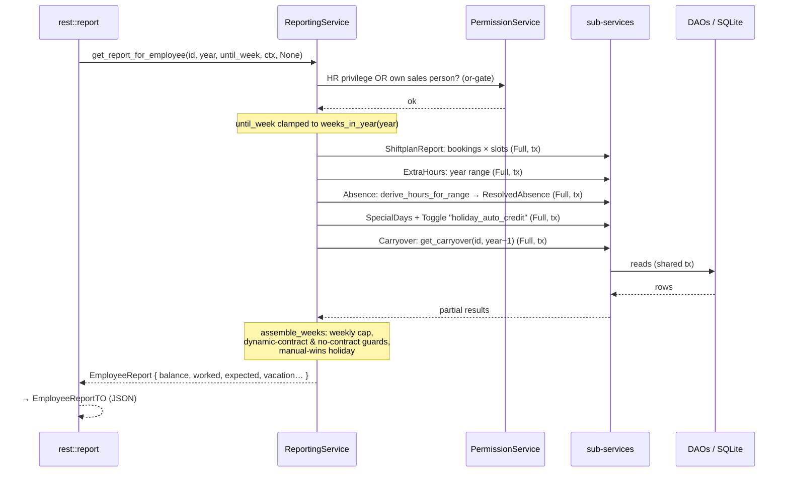
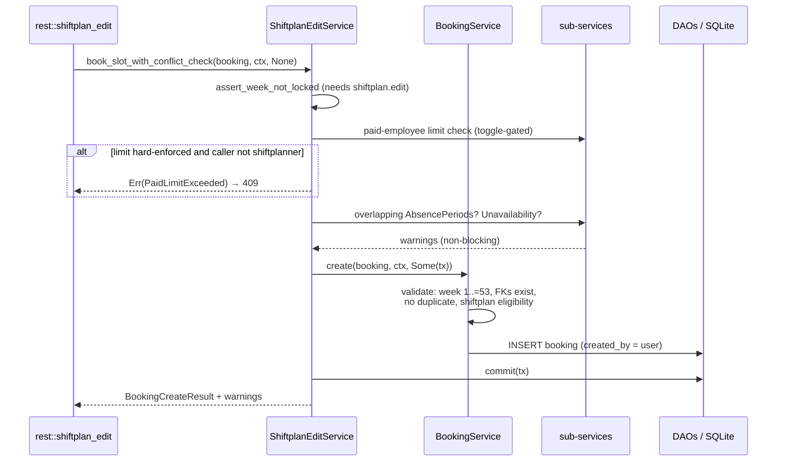
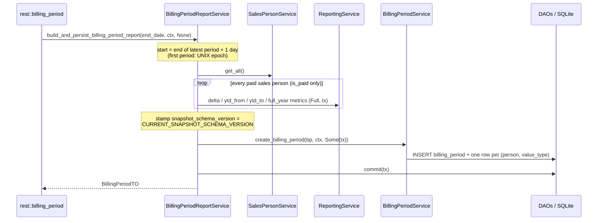
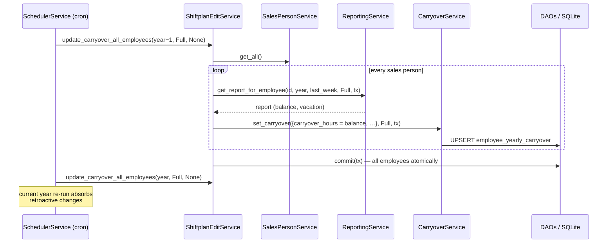

# 6. Runtime View

Four scenarios that together exercise every architecturally significant
mechanism: layered read fan-out, composable transactions, `Authentication::Full`,
scheduled jobs, snapshot freezing, and warning-based (non-blocking) validation.

## 6.1 Employee Balance Report (central read path)

`GET /report/{sales_person_id}?year=&until_week=` — the most important
computation in the system; also reused by scenarios 6.2 and 6.3.

Key points: the handler authenticates the *user*; all internal aggregate reads
then run with `Authentication::Full` on the same transaction (pure read, no
commit). Absence hours are **derived at read time** from the contract active on
each day — both the legacy `extra_hours` rows and range-based `absence_period`
rows are aggregated (post-cutover coexistence, see
[absence-system](../domain/absence-system.md)). Formula reference:
[time-accounting](../domain/time-accounting.md).

## 6.2 Booking Creation with Conflict Check (write path with warnings)

`POST /shiftplan-edit/booking` — the standard editor path (the raw
`POST /booking/` path skips the warning layer).

Design intent: domain **conflicts warn instead of block** (booking on an
absence day may be deliberate), while *structural* violations (duplicate,
locked week, hard paid-limit) are errors. The basic `BookingService` stays
reusable; all cross-aggregate policy sits in the business-logic tier.
Existing diagram: [`sequence-booking-create.mmd`](../architecture/diagrams/sequence-booking-create.mmd).

## 6.3 Billing-Period Snapshot Creation (freeze)

`POST /billing-period` (HR) — payout stability mechanism.

The whole snapshot runs in **one transaction** — a consistent read-set against
concurrent writes. Rows are write-once; only the *latest* period may be
deleted (`NotLatestBillingPeriod` otherwise); periods chain seamlessly.
Version semantics: [billing-period](../domain/billing-period.md).

## 6.4 Carryover Update (scheduled job)

The cron-driven year-end rollover — no HTTP involved.

This is where scenario 6.1's result becomes persistent state: the carryover
row for year *Y* stores the end-of-*Y* balance and is read back as the input
for year *Y+1* (`get_carryover(id, year − 1)`). Known limitation: retroactive
edits in a *closed* year are not auto-invalidated → see
[chapter 11](11-risks-and-technical-debt.md).
