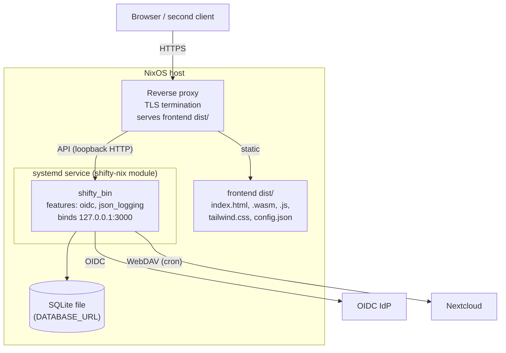

# 7. Deployment View

## 7.1 Production Infrastructure

Shifty deploys as a **NixOS module with a systemd service**. The deployment
definition lives in the sibling repository **`shifty-nix`**, which pins an
exact backend commit/tag. There is no container path in production
(`docker.nix` is stale) and no auto-deploy: releases are prepared with
`/release-version`, applied manually via `nixos-rebuild switch`
([deployment](../ops/deployment.md)).

Deployment-relevant properties:

- **Startup:** the generated `start.sh` runs `sqlx db setup` against the bundled
  `migrations/` (migrations apply automatically at service start), then starts
  `shifty_bin`.
- **Build artifacts (Nix flake):** `packages.backend-oidc` (production binary),
  `packages.default`/`backend-mock` (dev binary), `packages.frontend`
  (WASM bundle: `wasm-bindgen` → `wasm-opt -Oz` → `dist/`).
- **Hard build gate:** `nix build` runs `cargo clippy -- --deny warnings` and
  builds with `SQLX_OFFLINE=true` — reproducibility and lint-cleanliness are
  enforced at build time, not by convention.
- **Frontend delivery:** the backend serves **only** the API and Swagger UI;
  the static bundle is delivered by the reverse proxy (config in `shifty-nix`).
  The SPA discovers its backend URL at runtime from `/assets/config.json`.
- **Rollback:** roll back the `shifty-nix` pin and rebuild. The database has
  **no down-migrations** — schema rollback beyond additive changes requires
  restoring the SQLite file snapshot taken before the deploy
  ([database](../ops/database.md)).

## 7.2 Configuration

Environment variables actually read by the code (the ops doc partially lists
older names — see [chapter 11](11-risks-and-technical-debt.md)):

| Variable | Default | Purpose |
| --- | --- | --- |
| `DATABASE_URL` | — (required) | SQLite URL, e.g. `sqlite:./localdb.sqlite3` |
| `SERVER_ADDRESS` | `127.0.0.1:3000` | Bind address |
| `APP_URL` | `http://localhost:3000` | Public base URL; OIDC redirects, invitation links |
| `ISSUER` | — | OIDC issuer URL (`oidc` builds) |
| `CLIENT_ID` / `CLIENT_SECRET` | — / optional | OIDC client credentials |
| `BASE_PATH` | `http://localhost:3000/` | Server URL advertised in the OpenAPI schema |
| `TIMEZONE` | `UTC` | Timezone used by `ConfigService` |
| `ICAL_LABEL` | `Schicht` | Event label in generated iCal feeds |
| `RUST_LOG` | — | Log filtering; production uses `json_logging` |
| `SQLX_OFFLINE` | — | `true` in CI/Nix: use committed `.sqlx/` cache |

Secrets note: the Nextcloud WebDAV app token is stored in the
`pdf_export_config` table (masked in API responses, cleartext at rest — see
chapter 11).

## 7.3 Development Environment

| Aspect | Dev setup |
| --- | --- |
| Backend | `cargo run` (feature `mock_auth`): auto-creates users `DEVUSER`/`admin` with admin role, auto-creates a session on cookieless requests — no IdP needed. Port 3000. |
| Frontend | `dx serve` (Dioxus CLI 0.6.x pinned) on port 8080, hot reload; proxies API prefixes to `localhost:3000` via `[[web.proxy]]` entries in `Dioxus.toml` — **every new endpoint prefix must be added there** (recurring footgun). |
| Database | Local SQLite file (`env.example`); `sqlx migrate run --source migrations/sqlite`; destructive `sqlx database reset` allowed in dev only. |
| Toolchain | Nix dev shell (`flake.nix`): rustc, sqlx-cli, cargo-watch, wasm linker, nodejs (Tailwind), plus `openspec`/`gsd` workflow tools. |
| CI (GitHub Actions) | Backend: fmt-check, clippy `-D warnings`, build (both feature sets), test — with `SQLX_OFFLINE=true`. Frontend: separate workflow; release tags build and attach the `dist` tarball. No CD. |

Onboarding walkthrough: [first-week](../onboarding/first-week.md).
