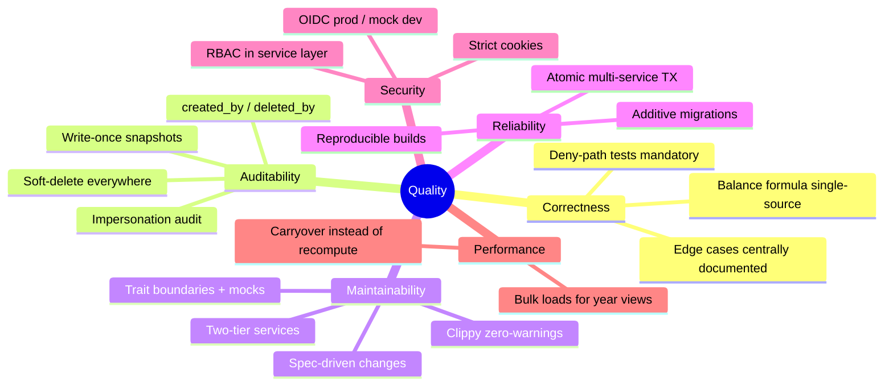

# 10. Quality Requirements

## 10.1 Quality Tree

## 10.2 Quality Scenarios

Concrete, testable scenarios (Q# ↔ quality goals in
[chapter 1.2](01-introduction-and-goals.md#12-quality-goals)).

### Correctness (Q1)

| ID | Scenario | Expected response |
| --- | --- | --- |
| C1 | An employee's contract changes mid-year while they have a vacation range spanning the change. | Absence hours are derived per-day from the contract active on each day; the balance uses the correct hours for both segments without any absence row being edited. |
| C2 | A slot is split and its bookings migrated while a weekly report is requested concurrently. | Both slot change and booking migration happen in one transaction; no report ever double-counts a booking (regression-tested). |
| C3 | A developer changes a permission gate. | A unit test exercising the **deny** path exists and fails if the gate weakens — dev-mode manual testing cannot catch this (mock user is admin). |
| C4 | The same balance is shown in the HR report, the employee view, and a snapshot. | All three consume `ReportingService`; no consumer re-derives the formula. |

### Auditability / payout stability (Q2)

| ID | Scenario | Expected response |
| --- | --- | --- |
| A1 | HR corrects a booking from a period that was already billed. | The existing snapshot is byte-identical afterwards; a validator comparing snapshot vs live sees the divergence and can attribute it. |
| A2 | The balance formula changes (new value type, changed input set). | `CURRENT_SNAPSHOT_SCHEMA_VERSION` is bumped in the same change; old snapshots remain readable and marked as computed under old rules. |
| A3 | A booking is deleted. | The row is soft-deleted with `deleted_by`; the booking log still shows it including who deleted it and when. |
| A4 | An admin impersonates a user for support. | Actions are attributable to the impersonation session (integration-tested). |

### Maintainability (Q3)

| ID | Scenario | Expected response |
| --- | --- | --- |
| M1 | A new developer sets up the project. | Day 1 of [first-week](../onboarding/first-week.md): backend + frontend run locally with mock auth, no IdP or DB server required. |
| M2 | A new aggregate (entity + CRUD + permissions) is added. | Pattern is mechanical: DAO trait + impl, Basic service trait + impl, REST handlers + TOs, migration, tests — no existing service needs modification unless it composes the new one. |
| M3 | Business logic must be unit-tested without a database. | Every dependency is an `automock`-ed trait; `MockClockService` makes time deterministic. |
| M4 | A change is proposed that touches domain semantics. | It goes through OpenSpec (proposal/design/specs) and lands as an archived decision record. |

### Reliability & reproducibility (Q4)

| ID | Scenario | Expected response |
| --- | --- | --- |
| R1 | A deploy goes wrong. | Rollback = revert the `shifty-nix` pin + rebuild; DB restored from the pre-deploy snapshot if the migration was non-additive. |
| R2 | Code passes `cargo test` but contains a clippy warning. | `nix build` (and CI) fail — warnings cannot reach production. |
| R3 | The scheduled carryover job runs while users edit bookings. | Job runs in its own transaction; SQLite serializes writers; a failed tick is retried on the next cron firing without corrupting state. |
| R4 | The same commit is built on two machines. | Bit-for-bit equivalent artifacts (Nix, locked dependencies, `SQLX_OFFLINE`). |

### Security (also Q1/Q2)

| ID | Scenario | Expected response |
| --- | --- | --- |
| S1 | An unauthenticated request hits any endpoint except iCal/authenticate. | 401 from `forbid_unauthenticated` before any handler runs. |
| S2 | An employee requests another employee's report. | 403: `ReportingService` or-gate requires HR privilege or ownership. |
| S3 | A code review finds `Authentication::Full` in a REST handler. | Treated as a critical defect (documented invariant, edge-cases §6). |

### Performance (secondary)

| ID | Scenario | Expected response |
| --- | --- | --- |
| P1 | A balance report for 2026 is requested in year 2030. | Cost is proportional to one year: prior years come from persisted carryover, not recomputation. |
| P2 | The weekly overview loads a full year. | Bulk loads (year-scoped queries) instead of ~55 sequential per-week calls (Phase 52 optimization). |
