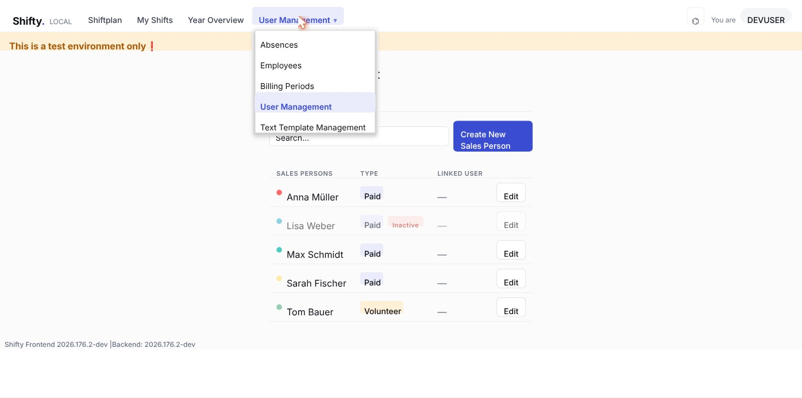
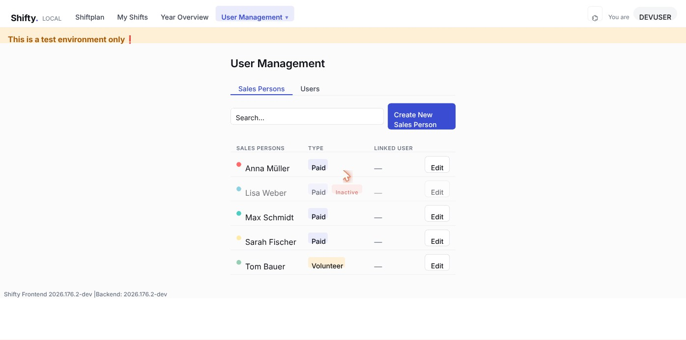
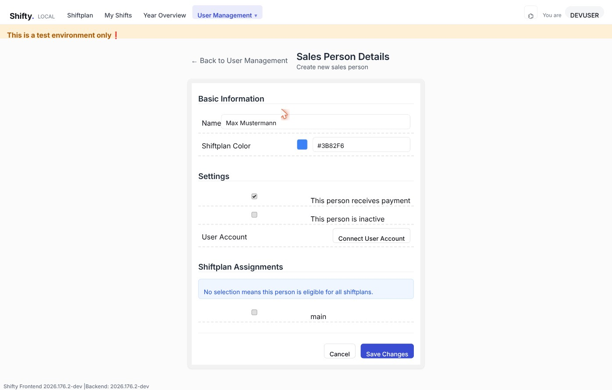
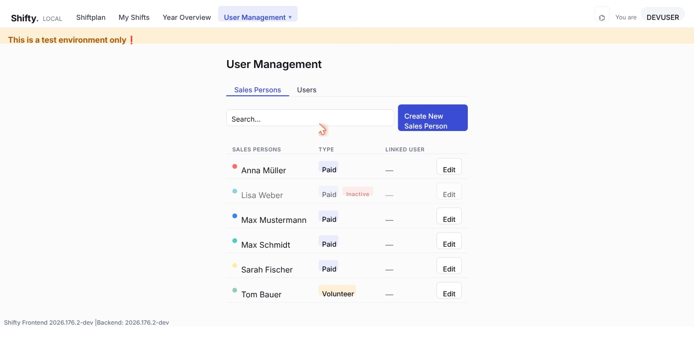
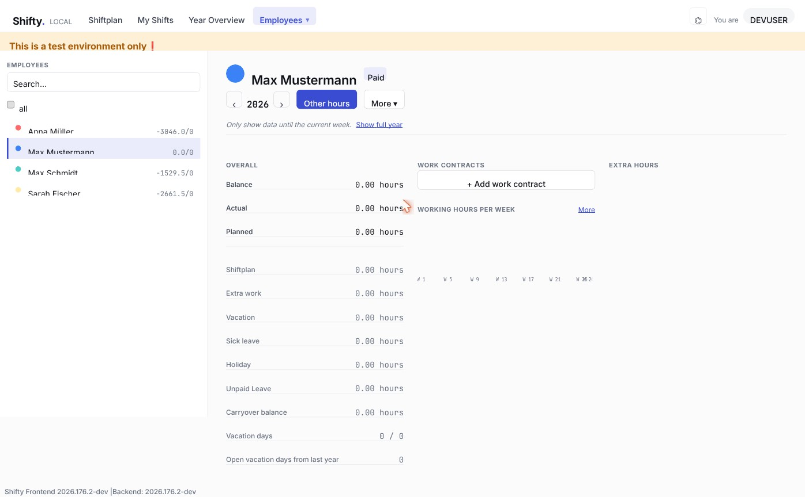
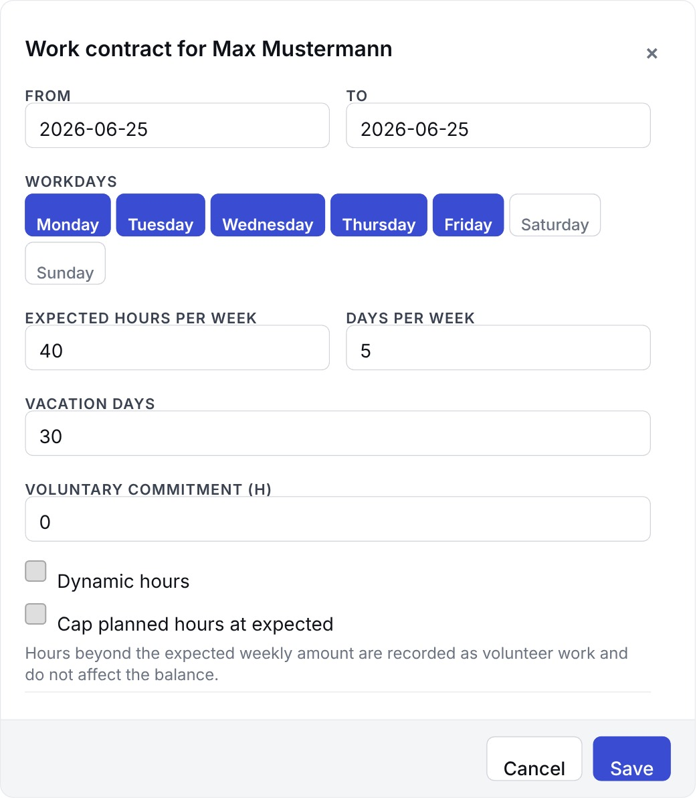
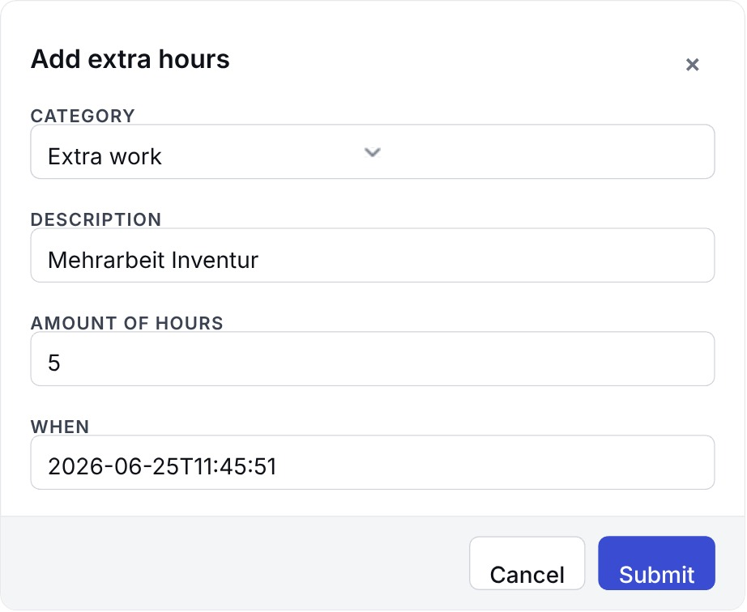
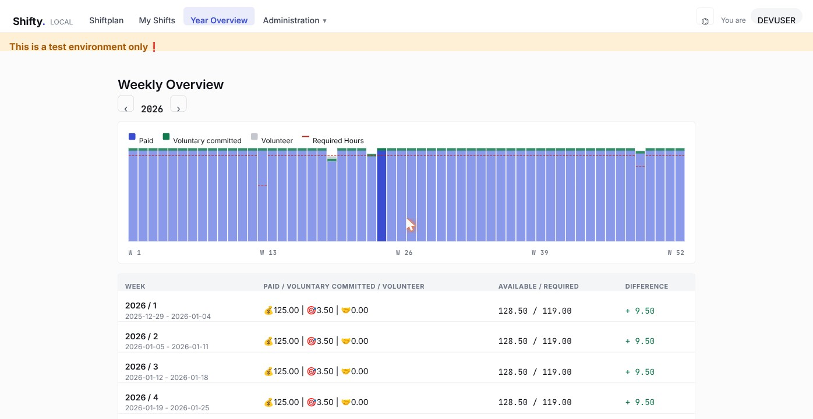

# Employee Management in Shifty

> 🌐 **English (default):** this page · **Deutsch:** [employee-management_de.md](employee-management_de.md)

This guide explains step by step how to create, edit, and manage employees
(called **Sales Persons** in the system) in Shifty. It is aimed at
administrators and HR staff.

> The screenshots come from a test environment. The user interface is in English.

## Contents

1. [Overview](#overview)
2. [Access: where do I find the management screens?](#1-access-where-do-i-find-the-management-screens)
3. [The employee overview](#2-the-employee-overview)
4. [Creating a new employee](#3-creating-a-new-employee)
5. [Editing or deactivating an employee](#4-editing-or-deactivating-an-employee)
6. [Working hours & hours account: the detail page](#5-working-hours--hours-account-the-detail-page)
7. [Adding a work contract](#6-adding-a-work-contract)
8. [Recording hours manually (hours account)](#7-recording-hours-manually-hours-account)
9. [The hours account](#8-the-hours-account)
10. [The year overview](#9-the-year-overview)
11. [FAQ](#faq)

---

## Overview

An employee in Shifty is made up of several building blocks:

| Building block | Meaning |
|----------------|---------|
| **Sales Person** | The employee's master data (name, color, paid/volunteer). |
| **Work Contract** | Defines the expected weekly hours, workdays, and vacation entitlement for a period. |
| **Extra Hours** (hours account) | Individual bookings such as extra work, vacation, sick leave, or holidays. |
| **User Account** (optional) | A login account that can be linked to the employee. |

Typical flow when onboarding a new employee:

1. **Create the Sales Person** (master data) → section 3
2. **Add a work contract** (weekly hours, vacation) → section 6
3. If needed, **record hours** or **link a login account**

---

## 1. Access: where do I find the management screens?

All employee-management features are reached through the **Administration** menu
in the top navigation bar.

Two entries are relevant for employee management:

- **User Management** – create and edit employees (Sales Persons) and manage login accounts.
- **Employees** – an employee's detail page with working hours, balance, and hours account.

---

## 2. The employee overview

Under **Administration → User Management**, the **Sales Persons** tab opens with
a list of all employees.

For each employee the list shows:

- **Color dot + name** – the identifying color used in the shift plan.
- **TYPE** – `Paid` or `Volunteer`; plus `Inactive` if the employee has been deactivated.
- **LINKED USER** – the linked login account (or `—` if none is linked).
- **Edit** – opens the master data for editing.

Use the **search field** to filter the list by name. Click
**Create New Sales Person** to add a new employee.

---

## 3. Creating a new employee

In the overview, click **Create New Sales Person**. The **Sales Person Details**
form opens.

### Basic Information

| Field | Meaning |
|-------|---------|
| **Name** | The employee's display name. |
| **Shiftplan Color** | Identifying color (hex code, e.g. `#3B82F6`) used to display the employee in the shift plan. The color square shows a preview. |

### Settings

| Setting | Meaning |
|---------|---------|
| **This person receives payment** | Enabled = paid employee (`Paid`). Disabled = volunteer (`Volunteer`). |
| **This person is inactive** | Deactivates the employee. Inactive employees are hidden from selection lists but kept for historical records (they are **not** deleted). |
| **User Account** | Use **Connect User Account** to link a login account. Without a link, the employee cannot sign in. |

### Letting an employee sign themselves in and out of shifts

For an employee to add and remove **themselves** from shifts, the Sales Person
record alone is not enough — they also need a login account with the right role.
This takes three steps:

1. **Create the user:** In **User Management**, switch to the **Users** tab,
   click **Add New User**, enter the username, and confirm with **Create User**.
2. **Assign the `sales` role:** Click **Edit** on the new user. On the **User
   Details** page, in the **Role Assignments** section, tick the **`sales`**
   role.
3. **Link it to the Sales Person:** Edit the Sales Person (**Sales Persons** tab →
   **Edit**), in the **User Account** section click **Connect User Account**,
   enter the **username** of the created user, and save with **Save Changes**.

> Without the **`sales`** role the employee can sign in but cannot add themselves
> to shifts. Without the link between the user account and the Sales Person, there
> is no association to the person.

### Shiftplan Assignments

Here you decide which shift plans the employee may be scheduled for. If nothing
is selected, the hint *"No selection means this person is eligible for all
shiftplans."* applies — the employee is then available for **all** shift plans.

Finally, click **Save Changes**. The new employee then appears in the overview.

---

## 4. Editing or deactivating an employee

To change the master data, click **Edit** next to the desired employee in the
overview (**User Management → Sales Persons**). The same form as for creating
opens.

**Delete vs. deactivate:** Employees are usually not deleted in Shifty, because
that would lose their hours and shift history. Instead, tick **This person is
inactive**. The employee then disappears from the active selection lists but
remains available for reporting.

---

## 5. Working hours & hours account: the detail page

The detailed view of an employee — with balance, work contracts, and hours
account — is found under **Administration → Employees**. Select the desired
employee from the list on the left.

The page uses a **master/detail layout**: the searchable employee list on the
left, the details of the selected employee on the right.

In the top right you can switch the **year** with the arrows and open further
actions with **Other hours** and **More**.

On the left, under **OVERALL**, are the balance metrics (Balance, Planned,
Vacation, etc.). What each one means is explained in
[section 8](#8-the-hours-account). To the right are the **WORK CONTRACTS**,
**WORKING HOURS PER WEEK** (weekly hours chart), and **EXTRA HOURS** (hours-account
bookings) sections.

---

## 6. Adding a work contract

A **Work Contract** defines how many hours an employee is expected to work per
week and how much vacation they are entitled to. Without a contract, the balance
stays empty.

In the **WORK CONTRACTS** section, click **+ Add work contract**. The following
dialog opens:

| Field | Meaning |
|-------|---------|
| **From / To** | Validity period of the contract. Several consecutive contracts form the contract history (e.g. when hours change). |
| **Workdays** | The regular workdays (Monday–Sunday). Active days are highlighted in blue. |
| **Expected hours per week** | Target hours per week — the basis for the balance calculation. |
| **Days per week** | Number of workdays per week. |
| **Vacation days** | Annual vacation entitlement in days. |
| **Voluntary commitment (h)** | **Volunteer capacity committed per week** in advance, on top of the paid target. Only takes effect when **Cap planned hours at expected** is active or the target is 0 (see [section 9](#9-the-year-overview)). |
| **Dynamic hours** | Enables a dynamic hours calculation instead of fixed weekly hours (target = actual). |
| **Cap planned hours at expected** | Caps the hours credited to the hours account at the target. Hours beyond that count as volunteer work and do not affect the hours account (*"Hours beyond the expected weekly amount are recorded as volunteer work and do not affect the balance."*). |

Click **Save** to store the contract; existing contracts can later be adjusted
or deleted via **Edit**.

### Splitting paid and volunteer hours (capping)

Capping (**Cap planned hours at expected**) is designed for the arrangement
*"part of the work is paid, the rest is voluntary"*.

- **Without capping:** All scheduled shift hours count as paid work and are
  applied to the hours account. Working more than the target produces overtime
  (a positive balance).
- **With capping:** Each week only hours **up to the target** count as paid
  work. Anything above is automatically recorded as **volunteer work** — no pay
  claim and **no** credit on the hours account.

**Example:** Target = 40 h/week, capping active. In one week 50 h are scheduled.
→ 40 h count as paid work (the hours account stays even); the remaining 10 h are
recorded as volunteer hours.

The **Voluntary commitment (h)** field additionally lets you record an *expected*
weekly volunteer capacity — useful for capacity planning (see
[section 9](#9-the-year-overview)).

---

## 7. Recording hours manually (hours account)

Individual hour bookings — such as extra work, vacation, or sickness — are
recorded via the **Other hours** button (top right on the detail page). The
**Add extra hours** dialog opens:

| Field | Meaning |
|-------|---------|
| **Category** | Type of booking (see list below). |
| **Description** | Free text for context (e.g. "Mehrarbeit Inventur"). |
| **Amount of hours** | Number of hours. |
| **When** | Time of the booking (date and time). |

Available **categories**:

- **Extra work**
- **Volunteer Work**
- **Holiday**
- **Sick leave**
- **Vacation**
- **Unavailable**
- **Unpaid Leave**

Click **Submit** to store the booking. Depending on the category it affects the
hours account and/or the reporting (see section 8). Existing entries appear in
the **EXTRA HOURS** section of the detail page, where they can be edited or
deleted.

---

## 8. The hours account

The **hours account** is the personal balance of target vs. actual. Simplified:

> **Hours account = hours worked − target + carryover from last year**
>
> hours worked = paid shift hours + extra work
> target = weekly hours, minus approved absences

The **OVERALL** section on the detail page (section 5) shows these metrics. The
table explains what each one means and whether it counts towards the hours
account:

| Metric | Meaning | Counts towards the hours account? |
|--------|---------|-----------------------------------|
| **Balance** | Plus or minus: how many hours someone worked more or less than agreed | the result itself |
| **Actual** | Hours actually worked | yes, as a plus |
| **Planned** | Agreed hours | yes, subtracted |
| **Shiftplan** | Hours from the shift plan | yes (part of hours worked) |
| **Extra work** | Recorded extra work | yes, as a plus |
| **Vacation** | Hours recorded as vacation | lowers the target for that time |
| **Sick leave** | Hours recorded as sick leave | lowers the target for that time |
| **Holiday** | Hours recorded as holidays | lowers the target for that time |
| **Unpaid Leave** | Hours recorded as unpaid leave | lowers the target for that time |
| **Volunteer Work** | Volunteer hours worked (only shown from half an hour upwards) | no (see below) |
| **Carryover balance** | Plus or minus from last year | yes, feeds in |
| **Vacation days** | Taken / available vacation days | no (vacation account) |
| **Open vacation days from last year** | Remaining vacation from last year | no (vacation account) |

The missing time for vacation, sickness, holidays, and unpaid leave is therefore
**not** counted as a deficit — it only lowers the target. The plus or minus at
year-end is carried into the new year (**Carryover balance**).

The personal hours account is shown on the **employee detail page** (section 5).
The **shift planner** additionally shows it as a weekly result — for planners and
HR, always for the whole week, not for individual days.

### Volunteer hours do not count towards the hours account

Volunteer hours are voluntary work — there is no pay or time compensation for
them. They therefore do **not** count towards the hours account. They arise in
three ways:

1. **Automatically through capping:** hours above the weekly target when **Cap
   planned hours at expected** is active (see section 6).
2. **Without a work contract:** when someone is scheduled in the shift plan but
   has no work contract for that period — then **all** their scheduled shift
   hours count as volunteer work. There is no agreed target to measure them
   against.
3. **Booked manually:** via the **Volunteer Work** category in the *Add extra
   hours* dialog (section 7).

Volunteer hours are surfaced in the **year overview** (section 9), so it stays
visible how much someone contributed beyond their paid work without distorting
the paid balance. If a person has at least half an hour of volunteer work, it
also shows up as a separate **Volunteer Work** row in the overall view of the
detail page (section 5).

---

## 9. The year overview

The year overview shows, week by week, how many hours are **available** and how
many are **required**. It is a planning aid and independent of the personal hours
account.

The available hours are split into three bands:

- **Paid** (💰) – the paid hours of the employees
- **Voluntary committed** (🎯) – volunteer hours pledged in advance (the contract
  field **Voluntary commitment**)
- **Volunteer** (🤝) – volunteer hours actually worked beyond the commitment. They
  arise when someone works more than the target while capping is active, when
  someone is scheduled without a work contract, or when volunteer work is booked
  manually (the three ways from section 8)

Together they make up the available hours. The red line in the chart marks the
**required hours**; the "available − required" difference shows whether a week is
over- or under-staffed.

---

## FAQ

**How do I tell paid and volunteer employees apart?**
Through the **This person receives payment** setting. Paid employees are marked
`Paid`, volunteers `Volunteer`.

**Can I delete an employee?**
True deletion is intentionally not available, in order to preserve the history.
Use **This person is inactive** instead.

**Why is a new employee's balance empty?**
As long as no **work contract** is set, there are no target hours — and therefore
no balance. Add a contract first (section 6).

**What is the Shiftplan Color for?**
It allows quick visual identification of the employee in the shift plan and in
the employee lists.
