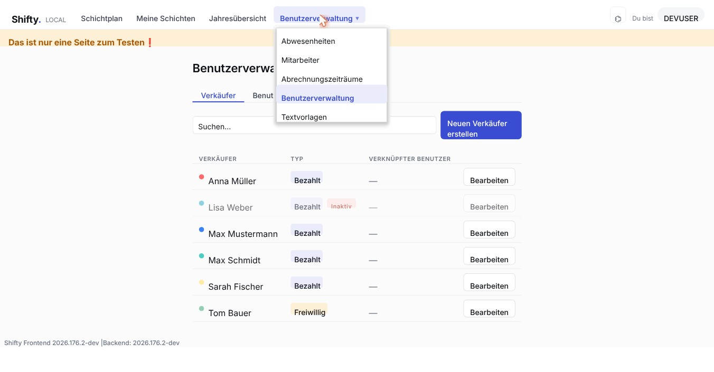
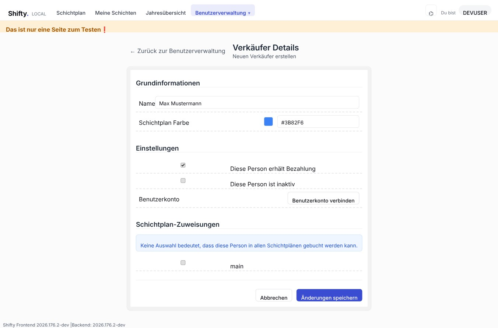
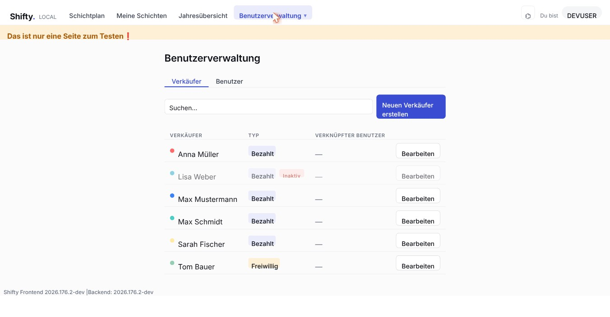
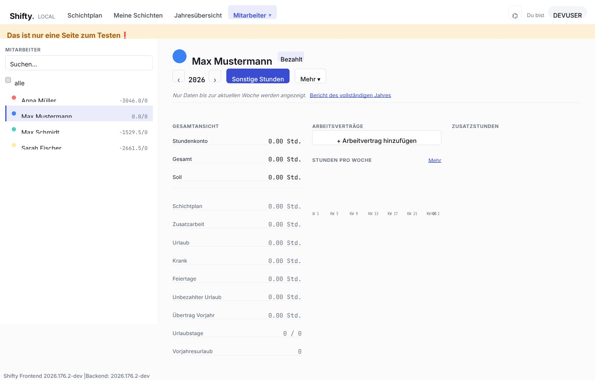
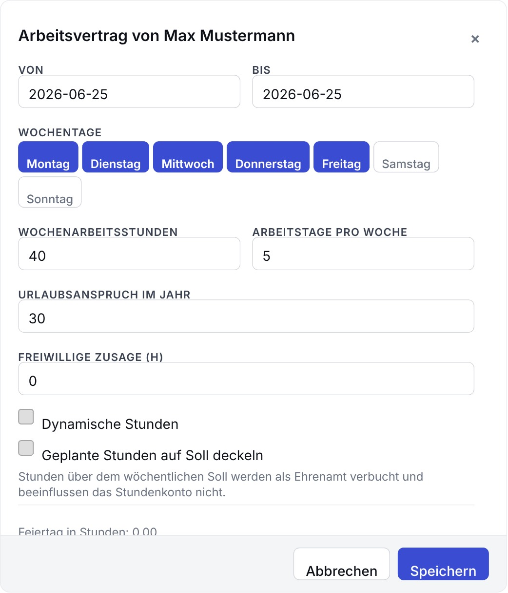
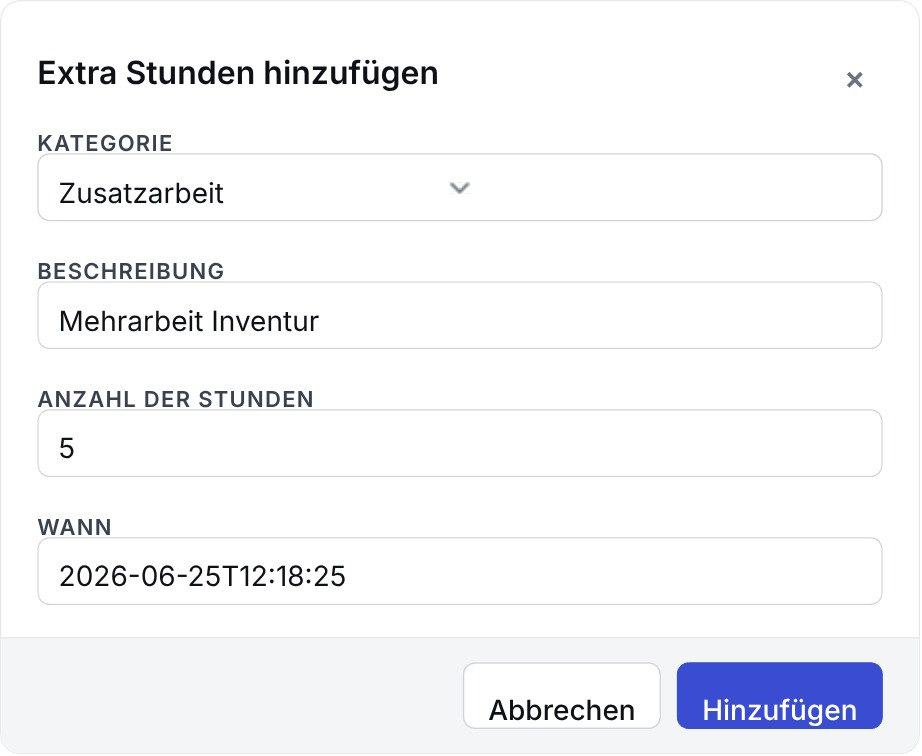
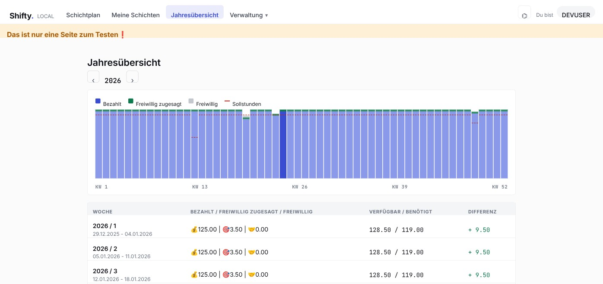

# Mitarbeiterverwaltung in Shifty

> 🌐 **English (default):** [employee-management.md](employee-management.md) · **Deutsch:** diese Seite

Diese Anleitung beschreibt Schritt für Schritt, wie Angestellte (im System
**Verkäufer** genannt) in Shifty angelegt, bearbeitet und verwaltet werden.
Sie richtet sich an Administrator:innen und HR-Verantwortliche.

> Die Screenshots stammen aus einer Testumgebung mit deutscher Oberfläche.
> Shifty wählt die Sprache automatisch anhand der Browser-Sprache.

## Inhalt

1. [Überblick](#überblick)
2. [Zugang: Wo finde ich die Verwaltung?](#1-zugang-wo-finde-ich-die-verwaltung)
3. [Die Verkäufer-Übersicht](#2-die-verkäufer-übersicht)
4. [Einen neuen Verkäufer anlegen](#3-einen-neuen-verkäufer-anlegen)
5. [Verkäufer bearbeiten oder deaktivieren](#4-verkäufer-bearbeiten-oder-deaktivieren)
6. [Arbeitszeiten & Stundenkonto: die Detailseite](#5-arbeitszeiten--stundenkonto-die-detailseite)
7. [Einen Arbeitsvertrag anlegen](#6-einen-arbeitsvertrag-anlegen)
8. [Stunden manuell erfassen (Zusatzstunden)](#7-stunden-manuell-erfassen-zusatzstunden)
9. [Das Stundenkonto](#8-das-stundenkonto)
10. [Die Jahresübersicht](#9-die-jahresübersicht)
11. [Häufige Fragen](#häufige-fragen)

---

## Überblick

Ein Angestellter in Shifty besteht aus mehreren Bausteinen:

| Baustein | Bedeutung |
|----------|-----------|
| **Verkäufer** | Die Stammdaten des Angestellten (Name, Farbe, bezahlt/freiwillig). |
| **Arbeitsvertrag** | Definiert die Wochenarbeitsstunden, Arbeitstage und den Urlaubsanspruch für einen Zeitraum. |
| **Zusatzstunden** (Stundenkonto) | Einzelne Buchungen wie Zusatzarbeit, Urlaub, Krankheit oder Feiertage. |
| **Benutzerkonto** (optional) | Ein Login-Konto, das mit dem Verkäufer verknüpft werden kann. |

Typischer Ablauf beim Onboarding eines neuen Angestellten:

1. **Verkäufer anlegen** (Stammdaten) → Abschnitt 3
2. **Arbeitsvertrag hinterlegen** (Wochenstunden, Urlaub) → Abschnitt 6
3. Bei Bedarf **Stunden erfassen** oder **Benutzerkonto verknüpfen**

---

## 1. Zugang: Wo finde ich die Verwaltung?

Alle Funktionen zur Mitarbeiterverwaltung erreichst du über das
**Verwaltungs-Menü** in der oberen Navigationsleiste (das aufklappbare Menü
rechts, erkennbar am ▾).

Für die Mitarbeiterverwaltung sind zwei Einträge relevant:

- **Benutzerverwaltung** – Verkäufer anlegen, bearbeiten und Benutzerkonten verwalten.
- **Mitarbeiter** – Detailseite eines Verkäufers mit Arbeitszeiten, Bilanz und Stundenkonto.

---

## 2. Die Verkäufer-Übersicht

Unter **Benutzerverwaltung** öffnet sich der Reiter **Verkäufer** mit einer
Liste aller Angestellten.

In der Liste siehst du je Verkäufer:

- **Farbpunkt + Name** – die im Schichtplan verwendete Kennfarbe.
- **TYP** – `Bezahlt` oder `Freiwillig`; zusätzlich `Inaktiv`, wenn der Verkäufer deaktiviert wurde.
- **VERKNÜPFTER BENUTZER** – das verknüpfte Benutzerkonto (oder `—`, wenn keines verknüpft ist).
- **Bearbeiten** – öffnet die Stammdaten zum Bearbeiten.

Über das **Suchfeld** kannst du die Liste nach Namen filtern. Mit
**Neuen Verkäufer erstellen** legst du einen neuen Angestellten an.

---

## 3. Einen neuen Verkäufer anlegen

Klicke in der Übersicht auf **Neuen Verkäufer erstellen**. Es öffnet sich das
Formular **Verkäufer Details**.

### Grundinformationen

| Feld | Bedeutung |
|------|-----------|
| **Name** | Anzeigename des Angestellten. |
| **Schichtplan Farbe** | Kennfarbe (Hex-Code, z. B. `#3B82F6`), mit der der Verkäufer im Schichtplan dargestellt wird. Das Farbquadrat zeigt eine Vorschau. |

### Einstellungen

| Einstellung | Bedeutung |
|-------------|-----------|
| **Diese Person erhält Bezahlung** | Aktiviert = bezahlter Mitarbeiter (`Bezahlt`). Deaktiviert = freiwillig (`Freiwillig`). |
| **Diese Person ist inaktiv** | Deaktiviert den Verkäufer. Inaktive Verkäufer werden in Auswahllisten ausgeblendet, bleiben aber für die Historie erhalten (sie werden **nicht** gelöscht). |
| **Benutzerkonto** | Über **Benutzerkonto verbinden** lässt sich ein Login-Konto verknüpfen. Ohne Verknüpfung kann sich die Person nicht selbst anmelden. |

### Selbstständiges Ein- und Austragen ermöglichen

Damit sich ein Mitarbeiter **selbst** in Schichten ein- und austragen kann,
genügt der Verkäufer-Datensatz allein nicht – er benötigt zusätzlich ein
Login-Konto mit der passenden Rolle. Dafür sind drei Schritte nötig:

1. **Benutzer anlegen:** In der **Benutzerverwaltung** in den Reiter **Benutzer**
   wechseln, auf **Neuen Benutzer hinzufügen** klicken, den Benutzernamen
   eingeben und mit **Benutzer erstellen** bestätigen.
2. **Rolle `sales` zuweisen:** Beim neuen Benutzer auf **Bearbeiten** klicken. Auf
   der Seite **Benutzer Details** im Bereich **Rollenzuweisungen** die Rolle
   **`sales`** ankreuzen.
3. **Mit dem Verkäufer verknüpfen:** Den Verkäufer bearbeiten (Reiter
   **Verkäufer** → **Bearbeiten**), im Bereich **Benutzerkonto** auf
   **Benutzerkonto verbinden** klicken, den **Benutzernamen** des angelegten
   Benutzers eintragen und mit **Änderungen speichern** sichern.

> Ohne die Rolle **`sales`** kann sich der Mitarbeiter zwar anmelden, sich aber
> nicht selbst in Schichten eintragen. Ohne die Verknüpfung zwischen
> Benutzerkonto und Verkäufer fehlt die Zuordnung zur Person.

### Schichtplan-Zuweisungen

Hier legst du fest, für welche Schichtpläne der Verkäufer eingeplant werden
darf. Bleibt alles unausgewählt, gilt der Hinweis *„Keine Auswahl bedeutet,
dass diese Person in allen Schichtplänen gebucht werden kann."*

Zum Abschluss auf **Änderungen speichern** klicken. Der neue Verkäufer erscheint
anschließend in der Übersicht.

---

## 4. Verkäufer bearbeiten oder deaktivieren

Um die Stammdaten zu ändern, klicke in der Übersicht (**Benutzerverwaltung →
Verkäufer**) beim gewünschten Verkäufer auf **Bearbeiten**. Es öffnet sich
dasselbe Formular wie beim Anlegen.

**Löschen vs. Deaktivieren:** Verkäufer werden in Shifty in der Regel nicht
gelöscht, da sonst die Stunden- und Schichthistorie verloren ginge. Stattdessen
setzt du den Haken bei **Diese Person ist inaktiv**. Der Verkäufer verschwindet
dann aus den aktiven Auswahllisten, bleibt aber auswertbar.

---

## 5. Arbeitszeiten & Stundenkonto: die Detailseite

Die ausführliche Sicht auf einen Angestellten – mit Bilanz, Arbeitsverträgen und
Stundenkonto – findest du über den Menüpunkt **Mitarbeiter**. Wähle links in
der Liste den gewünschten Mitarbeiter aus.

Die Seite ist als **Master/Detail-Ansicht** aufgebaut: links die durchsuchbare
Mitarbeiterliste, rechts die Details zum ausgewählten Mitarbeiter.

Oben rechts kannst du über die Pfeile das **Jahr** wechseln und mit
**Sonstige Stunden** bzw. **Mehr** weitere Aktionen aufrufen.

Links unter **Gesamtansicht** stehen die Bilanz-Kennzahlen (Stundenkonto, Soll,
Urlaub usw.). Was jede einzelne bedeutet, ist in [Abschnitt 8](#8-das-stundenkonto)
erklärt. Rechts daneben befinden sich die Bereiche **Arbeitsverträge**, **Stunden
pro Woche** (Wochenstunden-Diagramm) und **Zusatzstunden** (Stundenkonto-Buchungen).

---

## 6. Einen Arbeitsvertrag anlegen

Ein Arbeitsvertrag legt fest, wie viele Stunden ein Angestellter pro Woche
leisten soll und wie viel Urlaub ihm zusteht. Ohne Vertrag bleibt die Bilanz
leer.

Klicke im Bereich **Arbeitsverträge** auf **+ Arbeitvertrag hinzufügen**. Es
öffnet sich folgender Dialog:

| Feld | Bedeutung |
|------|-----------|
| **Von / Bis** | Von wann bis wann der Vertrag gilt. Mehrere Verträge nacheinander ergeben die Verlaufsgeschichte (z. B. wenn sich die Stunden später ändern). |
| **Wochentage** | An welchen Tagen (Montag–Sonntag) gearbeitet wird. Ausgewählte Tage sind blau. |
| **Wochenarbeitsstunden** | Die vereinbarten Stunden pro Woche – die Grundlage fürs Stundenkonto. |
| **Arbeitstage pro Woche** | Wie viele Tage pro Woche gearbeitet wird. |
| **Urlaubsanspruch im Jahr** | Wie viele Urlaubstage pro Jahr zustehen. |
| **Freiwillige Zusage (h)** | Pro Woche **fest zugesagte freiwillige Stunden** – zusätzlich zu den bezahlten Stunden im Voraus eingeplant. Wirkt nur, wenn **Geplante Stunden auf Soll deckeln** aktiv ist oder keine Wochenarbeitsstunden vereinbart sind (siehe [Abschnitt 9](#9-die-jahresübersicht)). |
| **Dynamische Stunden** | Statt fester Wochenstunden zählen die tatsächlich gearbeiteten Stunden als vereinbart (Soll = Ist). |
| **Geplante Stunden auf Soll deckeln** | Aufs Stundenkonto zählen nur die Stunden bis zum vereinbarten Wert. Was darüber liegt, gilt als Ehrenamt und wirkt nicht aufs Stundenkonto (*„Stunden über dem wöchentlichen Soll werden als Ehrenamt verbucht und beeinflussen das Stundenkonto nicht."*). |

Mit **Speichern** wird der Vertrag gespeichert; bestehende Verträge lassen sich
später über **Bearbeiten** anpassen oder löschen.

### Bezahlte und freiwillige Stunden trennen (Deckelung)

Die Deckelung (**Geplante Stunden auf Soll deckeln**) ist gedacht für die
Vereinbarung *„ein Teil der Arbeit ist bezahlt, der Rest ist freiwillig"*.

- **Ohne Deckelung:** Alle gearbeiteten Schichtstunden zählen als bezahlte
  Arbeit aufs Stundenkonto. Wer mehr arbeitet als vereinbart, sammelt ein Plus
  (Überstunden) an.
- **Mit Deckelung:** Pro Woche zählen nur die Stunden **bis zum vereinbarten
  Wert** als bezahlte Arbeit. Alles darüber wird automatisch als **Ehrenamt**
  verbucht – also kein Lohn und **kein** Plus auf dem Stundenkonto.

**Beispiel:** vereinbart sind 40 h pro Woche, die Deckelung ist aktiv. In einer
Woche stehen 50 h im Plan.
→ 40 h zählen als bezahlte Arbeit (das Stundenkonto bleibt ausgeglichen), die
übrigen 10 h werden als ehrenamtliche Stunden geführt.

Im Feld **Freiwillige Zusage (h)** kann man zusätzlich eintragen, wie viele
freiwillige Stunden pro Woche im Voraus erwartet werden – praktisch für die
Planung (siehe [Abschnitt 9](#9-die-jahresübersicht)).

---

## 7. Stunden manuell erfassen (Zusatzstunden)

Einzelne Stunden-Buchungen – etwa Zusatzarbeit, Urlaub oder Krankheit – erfasst
du über die Schaltfläche **Sonstige Stunden** (oben rechts auf der Detailseite).
Es öffnet sich der Dialog **Extra Stunden hinzufügen**:

| Feld | Bedeutung |
|------|-----------|
| **Kategorie** | Art der Buchung (siehe Liste unten). |
| **Beschreibung** | Freitext zur Erläuterung (z. B. „Mehrarbeit Inventur"). |
| **Anzahl der Stunden** | Anzahl der Stunden. |
| **Wann** | Zeitpunkt der Buchung (Datum und Uhrzeit). |

Verfügbare **Kategorien**:

- **Zusatzarbeit** – Mehrarbeit
- **Ehrenamt** – ehrenamtliche Arbeit
- **Feiertage**
- **Krank** – Krankheit
- **Urlaub**
- **Nicht verfügbar**
- **Unbezahlter Urlaub**

Mit **Hinzufügen** wird die Buchung gespeichert. Je nach Kategorie wirkt sie auf
das Stundenkonto und/oder die Auswertung (siehe Abschnitt 8). Bestehende Einträge
erscheinen im Bereich **Zusatzstunden** der Detailseite und können dort
bearbeitet oder gelöscht werden.

---

## 8. Das Stundenkonto

Das Stundenkonto zeigt, ob jemand mehr oder weniger gearbeitet hat als
vereinbart. Ganz einfach gesagt:

> **gearbeitete Stunden − vereinbarte Stunden = Plus oder Minus auf dem Stundenkonto**
> (dazu kommt noch das Plus oder Minus aus dem letzten Jahr)

Die **Gesamtansicht** auf der Detailseite (Abschnitt 5) zeigt dazu folgende
Kennzahlen. Die Tabelle erklärt, was jede bedeutet und ob sie aufs Stundenkonto
zählt:

| Kennzahl | Bedeutung | Zählt aufs Stundenkonto? |
|----------|-----------|--------------------------|
| **Stundenkonto** | Plus oder Minus: wie viele Stunden jemand mehr oder weniger gearbeitet hat als vereinbart | das Ergebnis selbst |
| **Gesamt** | Tatsächlich gearbeitete Stunden | ja, als Plus |
| **Soll** | Vereinbarte Stunden | ja, wird abgezogen |
| **Schichtplan** | Stunden aus dem Schichtplan | ja (Teil der gearbeiteten Stunden) |
| **Zusatzarbeit** | Erfasste Mehrarbeit | ja, als Plus |
| **Urlaub** | Als Urlaub erfasste Stunden | senkt das Soll für diese Zeit |
| **Krank** | Als Krankheit erfasste Stunden | senkt das Soll für diese Zeit |
| **Feiertage** | Als Feiertag erfasste Stunden | senkt das Soll für diese Zeit |
| **Unbezahlter Urlaub** | Als unbezahlter Urlaub erfasste Stunden | senkt das Soll für diese Zeit |
| **Ehrenamt** | Geleistete ehrenamtliche Stunden (nur sichtbar ab einer halben Stunde) | nein (siehe unten) |
| **Übertrag Vorjahr** | Plus oder Minus aus dem letzten Jahr | ja, fließt ein |
| **Urlaubstage** | Genommene / verfügbare Urlaubstage | nein (Urlaubskonto) |
| **Vorjahresurlaub** | Resturlaub aus dem letzten Jahr | nein (Urlaubskonto) |

Die fehlende Zeit bei Urlaub, Krankheit, Feiertagen und unbezahltem Urlaub wird
also **nicht** als Minus gewertet – sie senkt nur das Soll. Das Plus oder Minus
vom Jahresende wird ins neue Jahr übernommen (**Übertrag Vorjahr**).

Das persönliche Stundenkonto sieht man auf der **Mitarbeiter-Detailseite**
(Abschnitt 5). Im **Schichtplaner** wird es zusätzlich als Wochenergebnis
angezeigt – für Planer und HR, immer für die ganze Woche, nicht für einzelne
Tage.

### Ehrenamtliche Stunden zählen nicht aufs Stundenkonto

Ehrenamtliche Stunden sind freiwillige Arbeit – dafür gibt es weder Lohn noch
Zeitausgleich. Sie zählen deshalb **nicht** aufs Stundenkonto. Sie entstehen auf
drei Wegen:

1. **Automatisch durch Deckelung:** wenn die Deckelung aktiv ist und jemand mehr
   als das Soll arbeitet – die Stunden über dem Soll werden zu Ehrenamt (siehe
   Abschnitt 6).
2. **Ohne Arbeitsvertrag:** wenn jemand im Schichtplan eingetragen ist, für
   diesen Zeitraum aber kein Arbeitsvertrag hinterlegt ist – dann zählen **alle**
   geplanten Schichtstunden als Ehrenamt. Es gibt dann kein vereinbartes Soll, an
   dem die Stunden gemessen werden könnten.
3. **Von Hand eingetragen:** über die Kategorie **Ehrenamt** im Dialog „Extra
   Stunden hinzufügen" (Abschnitt 7).

Sichtbar werden ehrenamtliche Stunden in der **Jahresübersicht** (Abschnitt 9).
So sieht man, wie viel jemand zusätzlich freiwillig geleistet hat, ohne dass das
bezahlte Stundenkonto verfälscht wird. Hat eine Person mindestens eine halbe
ehrenamtliche Stunde, erscheinen diese außerdem als eigene Zeile **Ehrenamt** in
der Gesamtansicht der Detailseite (Abschnitt 5).

---

## 9. Die Jahresübersicht

Die Jahresübersicht zeigt Woche für Woche, wie viele Stunden **zur Verfügung
stehen** und wie viele **gebraucht werden**. Sie ist eine Planungshilfe und
unabhängig vom persönlichen Stundenkonto.

Die verfügbaren Stunden sind in drei Gruppen aufgeteilt:

- **Bezahlt** (💰) – die bezahlten Stunden der Mitarbeiter
- **Freiwillig zugesagt** (🎯) – im Voraus zugesagte freiwillige Stunden (das
  Vertragsfeld „Freiwillige Zusage")
- **Freiwillig** (🤝) – freiwillig geleistete Stunden, die über das Zugesagte
  hinausgehen. Sie fallen an, wenn jemand bei aktiver Deckelung mehr als das Soll
  arbeitet, wenn jemand ohne Arbeitsvertrag im Schichtplan steht oder wenn
  Ehrenamt von Hand eingetragen wird (die drei Wege aus Abschnitt 8)

Zusammen ergeben sie die verfügbaren Stunden. Die rote Linie im Diagramm zeigt,
wie viele Stunden gebraucht werden – so sieht man auf einen Blick, ob in einer
Woche genug Leute da sind.

---

## Häufige Fragen

**Wie unterscheide ich bezahlte und freiwillige Mitarbeiter?**
Über die Einstellung **Diese Person erhält Bezahlung**. Bezahlte Mitarbeiter
werden als `Bezahlt`, freiwillige als `Freiwillig` gekennzeichnet.

**Kann ich einen Verkäufer löschen?**
Ein echtes Löschen ist bewusst nicht vorgesehen, um die Historie zu erhalten.
Nutze stattdessen **Diese Person ist inaktiv**.

**Warum ist die Bilanz eines neuen Mitarbeiters leer?**
Solange kein **Arbeitsvertrag** hinterlegt ist, gibt es keine Soll-Stunden –
und damit keine Bilanz. Lege zuerst einen Vertrag an (Abschnitt 6).

**Wofür dient die Schichtplan Farbe?**
Sie dient der schnellen visuellen Zuordnung des Verkäufers im Schichtplan und
in den Mitarbeiterlisten.
